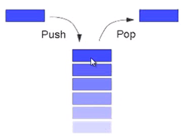
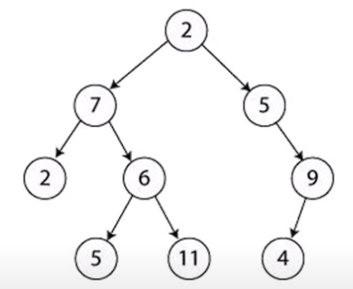
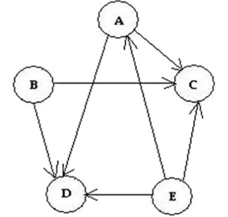

# Uso de TDA

### Conjuntos

A = {1, 3, 5, 7}

B = {2, 4, 6, 7}

A U B = {1, 2, 3, 4, 5, 6, 7}

### Listas Enlazadas

|Inicio| -> |dato| -> |dato| -> |datos| -> (Fin) -> null

- Procesadores de Texto.
- Principio de las BD.

### Colas

Estructura de Tipo FIFO (First In First Out)

Entrada -> |María|Peter|Carlos|Mery|Ligia|Simón| -> Salida

- Simular una caseta de Peaje.
- Simular un Cajero.

### Pilas

Estructura de Tipo LIFO (Last In First Out)

- Evaluación de expresiones aritméticas.

### Árboles

- Búsqueda de datos en BD.
- Orden en una BD.

### Grafos

- Transporte
- Álgebra Matricial

